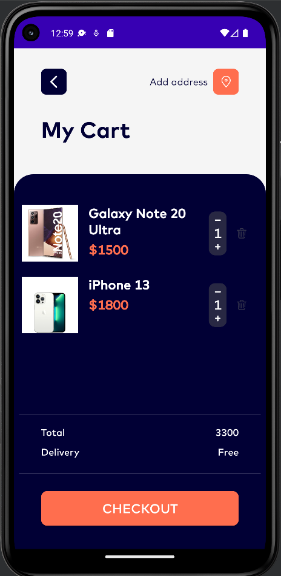

# Ecommerce Shop

## About
Ecommerce Shop - mobile app for the purchase of electronic equipment such as smartphones, computers etc.

## Technology stack
* Kotlin
* Retrofit
* OkHttp3
* LiveData
* MVVM
* Dagger 2
* Kotlin Coroutines
* Clean Architecture
* AndroidX Navigation
* XML

## Screens
 
 

